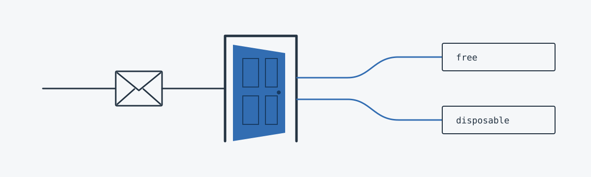

<h1 align="center">Doorman</h1>

<p align="center">
  Is this email from a free provider, a disposable one, or neither?<br>
  A small API that checks the domain against open lists. It doesn't check that the mailbox exists.
</p>

<p align="center">
  <a href="https://github.com/krystianslowik/doorman/actions/workflows/ci.yml"></a>
  
  <a href="LICENSE"></a>
</p>

<p align="center">
  <a href="https://doorman.krystianslowik.com/v1/check?email=jane@mailinator.com"><b>Live demo</b></a>
  &nbsp;&middot;&nbsp;
  <a href="#api">API</a>
  &nbsp;&middot;&nbsp;
  <a href="#run-it-yourself">Run it</a>
  &nbsp;&middot;&nbsp;
  <a href="#deploy-to-cloudflare">Deploy</a>
  &nbsp;&middot;&nbsp;
  <a href="#domain-lists">Domain lists</a>
</p>

<picture>
  <source media="(prefers-color-scheme: dark)" srcset="docs/doorman-readme-dark.svg">
  
</picture>

## Try it

The [demo](https://doorman.krystianslowik.com/v1/check?email=jane@gmail.com) needs no key and allows 5 requests per hour per client.

```bash
curl "https://doorman.krystianslowik.com/v1/check?email=jane@gmail.com"
```

```json
{ "input": "jane@gmail.com", "domain": "gmail.com", "free": true, "disposable": false }
```

Several at once:

```bash
curl -H "Content-Type: application/json" \
  -d '{"emails":["jane@gmail.com","jane@mailinator.com","jane@acme.com"]}' \
  https://doorman.krystianslowik.com/v1/check
```

This returns `{"results": [...]}`, one object per address. Disposable domains also count as free, so use `free && !disposable` for "regular free provider". Both `false` only means neither list matched; the lists aren't complete.

## API

`GET /v1/check?email=<email-or-domain>`, or `POST /v1/check` with `{"email": "..."}` or `{"emails": [...]}` (up to 100). An invalid batch item gets an `error` field instead of failing the batch. Prefer `POST` for real addresses, since query strings end up in logs. `/health` is public.

### Auth and limits

Keys go in `DOORMAN_API_KEY`, comma-separated (one per client, so you can revoke them separately), and are sent as `Authorization: Bearer <key>`. `openssl rand -hex 32` makes a good one.

On Cloudflare, requests without that header are anonymous: 5 per rolling hour per IPv4 address or IPv6 `/64`, a batch counting as one. Responses carry `ratelimit-limit` and `ratelimit-remaining`; over the limit you get `429` with `retry-after`. A valid key is unlimited, a wrong one gets `401`. Node and Docker have no anonymous mode and won't start without a key.

### How input is matched

- The host is trimmed, lowercased and punycoded, so `x@Bücher.de` matches `xn--bcher-kva.de`. A literal `+` in the GET query is kept.
- The host and each parent are checked down to the registrable domain, which is what `domain` returns: `x@0.mail.mujur.id` checks `0.mail.mujur.id`, `mail.mujur.id`, `mujur.id`. Private suffixes count, so `foo.github.io` stands alone.
- IP addresses, URL-ish input (`gmail.com/acme.com`) and hosts without a registrable domain (`github.io`, `localhost`) are rejected.

### Status codes

`200` ok, `400` bad input or body, `401` missing or wrong key, `404` unknown route, `405` wrong method, `413` body over 64 KiB, `429` anonymous limit reached (Worker only), `500` bug.

## Run it yourself

Needs Node.js 24+.

```bash
cp .env.example .env    # set DOORMAN_API_KEY=local-test-key
npm ci
npm test
```

```bash
npm run dev                                   # Node, port 3851, reloads on save
docker build -t doorman . && docker run --rm -p 3851:3851 --env-file .env doorman
npx wrangler dev                              # the Worker with its rate limiter, port 8787
```

Node and Docker read `MAX_BATCH_SIZE` (default 100) from `.env`; the Worker is fixed at 100.

## Deploy to Cloudflare

The Worker bundles the lists and does the check itself, so the free plan is enough. The limit is a Durable Object per client, since Cloudflare's own rate limiting can't count over an hour below Enterprise.

```bash
npx wrangler deploy
npx wrangler secret put DOORMAN_API_KEY    # optional: key1,key2 for unlimited access
curl "https://doorman.<your-subdomain>.workers.dev/v1/check?email=a@gmail.com"
```

The demo's hostname is attached with Terraform outside this repo; add yours in the dashboard or `wrangler.jsonc`. To rotate keys, set old and new, move clients, drop the old one.

## Domain lists

The lists live in [`data/`](data/) and ship with the service, so checks never go to the internet. `free.txt` and `disposable.txt` are generated from the URLs in `sources.json`. `manual-free.txt` holds free providers added by hand, and `blacklist.txt` domains that must never be listed (a leading `.` covers subdomains).

### Refreshing

```bash
npm run update-data     # download every source, rewrite free.txt and disposable.txt
npm test                # list integrity, plus well-known domains classified right
git diff --stat data/
```

Commit `data/`, then redeploy the Worker, rebuild the image or restart Node.

Both files are rebuilt from scratch, so upstream removals propagate. `blacklist.txt` beats everything, `manual-free.txt` beats disposable sources, disposable beats free. Nothing is written if a source fails or a file would shrink by more than 10% (override with `npm run update-data -- --allow-shrink`).

### Editing by hand

Add missing free providers to `manual-free.txt` with a dated comment. Keep a domain out of both lists with `blacklist.txt`; editing the generated files won't stick. Sources in `sources.json` can be JSON arrays or one domain per line. Then run `npm run update-data` and `npm test`.

### Sources

- Free: [Kikobeats/free-email-domains](https://github.com/Kikobeats/free-email-domains) (MIT) and [ankaboot-source/email-open-data](https://github.com/ankaboot-source/email-open-data) (CC0).
- Disposable: [castle](https://github.com/castle/disposable-email-domains) (MIT), [disposable-email-domains](https://github.com/disposable-email-domains/disposable-email-domains) (CC0) and [disposable](https://github.com/disposable/disposable-email-domains) (MIT).

Notices are in [`THIRD_PARTY_NOTICES.md`](THIRD_PARTY_NOTICES.md).

## Credits

The idea comes from the unmaintained [willwhite/freemail](https://github.com/willwhite/freemail) (ISC). No shared code, but the first blacklist entries and some country domains come from its lists.

## Licence

[MIT](LICENSE). The lists keep their own licences.
